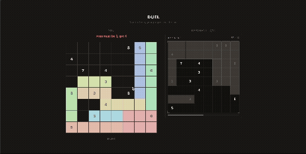

Drawn inspiration from [Shikaku](https://en.wikipedia.org/wiki/Shikaku), as well as EECS 498 at the University of Michigan. Contains the board representation, tile shapes, and puzzle generation logic.

### Design Choice / Architecture

This is a monorepo with mainly three packages:

- **`packages/core`** - Board representation, tile shapes, puzzle generation via backtracking. Shared by both client and the server. Using deep abstractions and subtype polymorphism for individual tile representations.
- **`client`** - React, TailwindCSS UI. Drag to draw rectangles, undo, skip, and auto-scaling difficulty.
- **`server`** - Express, WebSocket server for a ~*proposed*~ real-time duel mode. Handles session creation, move validation, and opponent broadcasting.

*Initial Duel UI (as of 4/18/26)*



### Getting Started
```bash
pnpm install

# solo play
pnpm run dev:client

# duel server
pnpm run dev:server
```

Primary objective of this project is to understand software design patterns that appear in larger codebases, and to explore certain tradeoffs in writing TypeScript. TypeScript was chosen out of respect to what's commonly used in fullstack, as well as from [EECS 498](https://eecs498-software-design.org/). Thanks. (note, please assume this project is done for the scope of desktop view only)

### Logs
**[04/18/26]**: As of today, I've wrapped up the initial setup of the project, so the functionality for every initially proposed feature is now in place. The only remaining issues are resolving errors in session handling, managing concurrency, and dealing with scaling. For now, I'm gonna put this project on hold for a while, but it was great to learn more about socket programming and adopt software design principles within a monorepo structure, where things can get messy quickly.

**[04/24/26]**: Client and server communications were not synced well and tile placement was iffy so I went back and fixed/revised how this was handled. `handlePlace` function in the server/ was generating its own tileId that doesn't match the client's local ID, making the UI look pretty out of sync. All fixed.